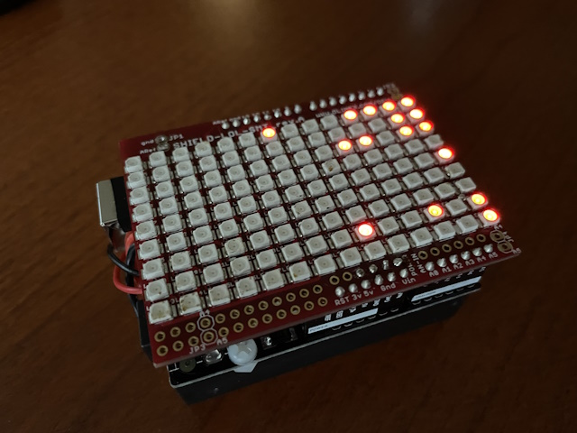

# "SAND DICE" - A falling sand grains and electronic dice pair game

## Description

This program implements "SAND DICE" - an electronic dice pair.
It uses an Arduino Uno board, a Lots-of-LEDs (LoL) Shield, and 
an MPU6050 IMU.

The LoL Shield - which is an array of 14x9 LEDs - starts with a number of 
sand grains placed randomly on the array. Grains then move (like falling sand 
in an hour-glass) as the shield is moved around (tilted, etc.) and as
dictated by the acceleration values read periodically from the IMU.
If Shield is not moved for a short time (i.e., it's let to rest), then,
two random numbers in the interval [1..6] are generated and displayed
on the array; sand grains are replaced with the two numbers displayed like 
two dice. Once Shield if moved again, the whole game is repeated.

## Video description
https://youtu.be/22_NVALrPag

## Hardware

If you wanted to replicate this project, these are the main components.

--Arduino Uno board; you can get any, but this is one example:
https://www.amazon.com/ELEGOO-Board-ATmega328P-ATMEGA16U2-Compliant/dp/B01EWOE0UU
--LoL Shield
https://www.olimex.com/Products/Duino/Shields/SHIELD-LOL-SMT/open-source-hardware
But, you can use one of those that you need to solder yourself; just search for
LoL Shield on Ebay and you will find many offerings.
--MPU6050 IMU
https://www.amazon.com/HiLetgo-MPU-6050-Accelerometer-Gyroscope-Converter/dp/B01DK83ZYQ?th=1
--Prototype PCB for Arduino Uno
https://www.amazon.com/dp/B01J1KM3RM?ref=ppx_yo2ov_dt_b_fed_asin_title (used one only of the pack)
--Battery holder
https://www.amazon.com/gp/product/B07C6XC3MP/ref=ppx_yo_dt_b_search_asin_title?ie=UTF8&psc=1

## Software

--Arduiono IDE
--Libraries needed:
1) LoLShield v82.zip - Downloaded from here: 
https://code.google.com/archive/p/lolshield/downloads
Installed from .ZIP inside the Arduino IDE.
2) Adafruit MPU6050
Installed through the Library Manager of the Arduino IDE.

## Credits

The source code is adapted from that of Chuck Swiger.
His code is here: https://github.com/cswiger/LED_sand
Inspired also by a project from Adafruit:
https://learn.adafruit.com/animated-led-sand?embeds=allow